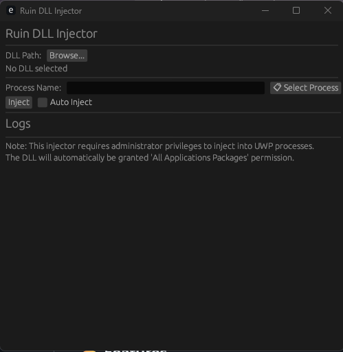

# Ruin DLL Injector

A modern, lightweight DLL injector built with Rust and egui, designed for Windows applications. Inspired by [FateInjector](https://github.com/fligger/FateInjector).



## Features

- **Modern GUI**: Clean, responsive interface built with egui with type-safe animations
- **Advanced Animation System**: Custom Fade, Scale, Slide, and Pulse animation types with Animatable trait
- **Process Browser**: Visual selection from running processes with search functionality
- **Auto Configuration**: Atomic config writes prevent corruption (temp file + rename pattern)
- **Auto Inject**: Automatically inject when target process is detected
- **Injection History**: Tracks last 10 injections with timestamps
- **Real-time Logging**: Monitor injection status with animated log entries
- **UWP Protection**: Detects and blocks injection into UWP apps (WindowsApps/AppPackages)
- **No Console**: Pure GUI application - no black terminal windows
- **Lightweight**: ~4.5 MB executable with minimal dependencies
- **Robust Error Handling**: Comprehensive error types with actionable messages
- **Architecture Detection**: Prevents 32-bit/64-bit mismatch errors
- **Admin Status**: Real-time administrator privilege indicator with pulse animation

## System Requirements

- Windows 10/11 (64-bit)
- Administrator privileges (required for some processes, not all)
- The DLL file you want to inject

## Quick Start

### Building

```bash
cargo build --release
```

The compiled executable will be at `target/release/ruin-injector.exe`.

### Adding an Icon

Place your `.ico` file as `icon.ico` in the project root directory and rebuild. See [ICON.md](ICON.md) for detailed instructions.

## Usage

1. **Run Application**
    ```bash
    .\ruin-injector.exe
    ```
    (Right-click -> "Run as administrator" for maximum compatibility)

2. **Select DLL File**
    - Click "Browse" button
    - Navigate to and select your DLL file

3. **Choose Target Process**
    - Click "List" button
    - Use search box to filter processes
    - Click on desired process

4. **Inject**
    - Click "Inject DLL" button
    - Monitor log section for success/error messages

### Features in Detail

#### Process Selection
- **Live Process List**: Shows all currently running processes
- **Search/Filter**: Type to quickly find specific processes
- **Process Info**: Displays process name and PID (Process ID)
- **UWP Detection**: Automatically identifies and warns about UWP applications
- **Animated Window**: Process list opens with smooth scale animation

#### Injection Options
- **Auto Inject**: Automatically inject when target process is detected
  - Enable via checkbox in UI
  - Settings persist across sessions (atomic writes)
  - Detects process start and injects automatically
  - Shows "Active" indicator with pulse animation
- **Manual Inject**: Click Inject button for immediate injection
- **Architecture Validation**: Ensures injector and target process bitness match

#### Visual Enhancements
- **Type-Safe Animations**: Fade, Scale, Slide, Pulse structs with Animatable trait
- **Fade-in Animation**: Title fades in smoothly on startup
- **Slide Animation**: Content slides in from below
- **Log Animation**: New log entries fade in as they're added
- **Window Scaling**: Process selector window scales in/out smoothly
- **Modal Blur**: Blurred background overlay for dialogs
- **Status Indicators**: Animated pulses for admin/auto-inject status

#### Error Handling
- **Detailed Messages**: Contextual error descriptions with suggestions
- **Architecture Mismatch**: Clear explanation of bitness issues
- **UWP Process**: Informative warning about unsupported apps
- **Actionable Advice**: "Try running as Administrator" when applicable
- **DLL Load Failures**: Detailed causes (missing deps, anti-cheat, etc.)

## Architecture

```
rust-injector/
├── src/
│   ├── main.rs          # Entry, egui UI, animation system, state management
│   ├── injector.rs      # Core injection, Windows API, UWP detection, architecture checks
│   └── config.rs       # Config persistence with atomic writes
├── Cargo.toml           # Project dependencies and metadata
├── build.rs             # Windows resource compilation (icon embedding)
├── icon.ico             # Application icon (optional, auto-embedded)
├── cliff.toml           # Changelog generation configuration
├── README.md            # This file
├── README_CN.md        # Chinese documentation
├── ICON.md             # Icon usage instructions
└── AGENTS.md           # Guidelines for AI coding assistants
```

## Technical Implementation

### DLL Injection Process

1. **Process Discovery**
   - Uses `CreateToolhelp32Snapshot(TH32CS_SNAPPROCESS)` to enumerate processes
   - Iterates with `Process32First` and `Process32Next`

2. **UWP Detection** (NEW)
   - Checks process path for WindowsApps/AppPackages directories
   - Uses `QueryFullProcessImageNameW` for accurate paths (Windows 8.1+)
   - Returns `UwpProcessNotSupported` error for UWP apps
   - Provides actionable warning message

3. **Architecture Compatibility**
   - Checks injector bitness (32/64) via `cfg(target_pointer_width)`
   - Detects target process architecture using `IsWow64Process`
   - Prevents mismatched injections with clear error messages

4. **Process Access**
   - Opens target process with `OpenProcess(PROCESS_ALL_ACCESS, ...)`
   - Handles Windows permission models
   - Injection will fail gracefully if insufficient permissions

5. **Memory Allocation**
   - Allocates memory in target process via `VirtualAllocEx(...)`
   - Sets memory protection to `PAGE_READWRITE`

6. **DLL Path Injection**
   - Writes DLL path string to allocated memory using `WriteProcessMemory(...)`
   - Converts path to UTF-16 wide string format
   - Validates path length (MAX_PATH_LENGTH = 260)

7. **Remote Thread Creation**
   - Creates a thread in target process via `CreateRemoteThread(...)`
   - Thread entry point is `LoadLibraryW` (obtained via `GetProcAddress`)
   - Waits for completion with 10-second timeout

8. **Cleanup**
   - Waits for thread completion with `WaitForSingleObject(...)`
   - Checks thread exit code (NULL indicates LoadLibraryW failed)
   - Frees allocated memory with `VirtualFreeEx(...)`
   - Closes all handles properly

### Core Windows APIs Used

| API | Purpose |
|-----|---------|
| `CreateToolhelp32Snapshot` | Create process snapshot |
| `Process32First/Next` | Enumerate processes |
| `OpenProcess` | Access target process |
| `IsWow64Process` | Detect process architecture |
| `QueryFullProcessImageNameW` | Get full process path |
| `VirtualAllocEx` | Allocate memory in target |
| `WriteProcessMemory` | Write DLL path to target |
| `GetProcAddress` | Get function address |
| `CreateRemoteThread` | Create remote execution thread |
| `LoadLibraryW` | Load DLL in target process |
| `CloseHandle` | Release resources |
| `GetLastError` | Get error codes |
| `WaitForSingleObject` | Wait for thread completion |
| `GetExitCodeThread` | Check thread result |

### Animation System

The application uses a type-safe, modular animation system:

**Animation Types**:
```rust
trait Animatable {
    fn update(&mut self, dt: f32);
    fn is_complete(&self) -> bool;
}

struct Fade { current: f32, target: f32, speed: f32 }
struct Scale { current: f32, target: f32, speed: f32 }
struct Slide { current: f32, target: f32, speed: f32 }
struct Pulse { phase: f32, speed: f32, amplitude: f32, base: f32 }
struct ModalAnimation { fade: Fade, scale: Scale }
```

**Usage**:
- **Fade Animation**: Alpha value interpolation for UI elements
- **Slide Animation**: Y-offset interpolation for panel movement
- **Scale Animation**: Window scale interpolation for dialogs
- **Pulse Animation**: Continuous phase rotation for status indicators
- **Log Alpha**: Per-log entry transparency for smooth fade-in

**Animation Constants**:
```rust
const ANIMATION_DEFAULT_SPEED: f32 = 0.12;
const ANIMATION_FAST_SPEED: f32 = 0.2;
const PULSE_SPEED_DEFAULT: f32 = 0.03;
const ALPHA_THRESHOLD: f32 = 0.01;
const SCALE_THRESHOLD: f32 = 0.01;
```

### Configuration Management (UPDATED)

**Atomic Write Pattern**:
```rust
// Write to temp file first
let temp_path = config_path.with_extension("tmp");
fs::write(&temp_path, config_str)?;

// Then rename (atomic on most filesystems)
fs::rename(&temp_path, &config_path)?;
```

**Benefits**:
- Prevents config corruption on crash/power loss
- Thread-safe configuration updates
- Graceful fallback on first run

### Error Handling

All operations include comprehensive error handling:

```rust
pub enum InjectionError {
    ProcessNotFound(String),
    OpenProcessFailed(String),
    MemoryAllocationFailed(String),
    WriteMemoryFailed(String),
    CreateRemoteThreadFailed(String),
    InvalidPath(String),
    InvalidProcessName(String),
    PathTooLong(String),
    DllLoadFailed(String),
    ThreadWaitFailed(String),
    UwpProcessNotSupported(String),  // NEW
}
```

**Error Display**:
- Errors are displayed in UI log with descriptive context
- Color-coded (red for errors, green for success)
- Actionable suggestions (e.g., "Try running as Administrator")
- Detailed causes for DLL load failures

## Development

### Build Commands

```bash
# Release build (optimized)
cargo build --release

# Development build (faster)
cargo build

# Clean and rebuild
cargo clean && cargo build --release

# Fast compile check
cargo check
```

### Linting and Formatting

```bash
# Run clippy linter
cargo clippy

# Format code with rustfmt
cargo fmt

# Check formatting without changes
cargo fmt --check
```

### Testing

```bash
# Run all tests
cargo test

# Run tests with output
cargo test -- --nocapture

# Run specific test
cargo test test_name
```

**Test Coverage** (v1.3.0):
- 21 comprehensive unit and integration tests
- Process enumeration
- Input validation
- Error handling
- Configuration management
- UI logging functionality
- Animation system tests
- Modal animation tests
- Button hover animations

### For AI Agents

See [AGENTS.md](AGENTS.md) for detailed guidelines on:
- Code style conventions
- Build/test commands
- Project structure
- Common pitfalls
- Testing strategies
- Animation system architecture

### Recent Improvements (v1.3.0)

Major updates to codebase:

1. **Animation System Redesign**: Complete rewrite with type-safe architecture
   - Animatable trait for unified interface
   - Fade, Scale, Slide, Pulse animation types
   - Removed raw f32 fields from AnimationState
   - Builder pattern for configuration (with_speed, with_easing)
   - Zero magic numbers throughout

2. **UWP Process Detection**: Prevents injection into Universal Windows Platform apps
   - Checks for WindowsApps/AppPackages directories
   - UwpProcessNotSupported error with warning message
   - QueryFullProcessImageNameW for accurate paths

3. **Atomic Config Writes**: Prevents configuration file corruption
   - Temp file + rename pattern
   - Thread-safe updates
   - Graceful fallback handling

4. **Enhanced Error Messages**: Detailed, actionable error descriptions
   - Architecture mismatch detection and explanation
   - DLL load failure causes (dependencies, anti-cheat, etc.)
   - "Try running as Administrator" suggestions

5. **Code Quality**: Production-ready codebase
   - Zero compiler warnings
   - Zero clippy warnings
   - Full rustfmt compliance
   - All 21 tests passing

6. **Modal Animations Fixed**: Consistent scale + fade behavior
   - Window background now fades properly
   - Both modals use same animation pattern

## Important Notes

### Security Considerations

- **Antivirus Detection**: DLL injection is a common technique monitored by antivirus software
- **Permission Model**: Injection works with current permissions - some processes may require administrator access
- **Process Protection**: System-protected processes cannot be injected
- **UWP Apps**: Universal Windows Platform applications have restricted injection capabilities
- **Architecture Matching**: Injector and target process must match (32-bit or 64-bit)

### Best Practices

- **Backup DLLs**: Keep backups of original DLLs when modifying
- **Test in Safe Environment**: First test injection on non-critical applications
- **Monitor Logs**: Always check log output for errors or warnings
- **Close Handles**: All Windows handles are properly closed to prevent leaks
- **Check Architecture**: Ensure your DLL matches target process bitness
- **Avoid UWP**: Don't attempt to inject into UWP applications

### Limitations

- **Process Protection**: System-protected processes (e.g., `csrss.exe`, `lsass.exe`) cannot be injected
- **Antivirus Interference**: Real-time protection may block injection attempts
- **Permission Dependent**: Some processes may require administrator access for successful injection
- **UWP Applications**: UWP apps cannot be injected (intentionally blocked)
- **Architecture Mismatch**: 32-bit injector cannot inject 64-bit processes (and vice versa)

## License

This project is provided **as-is** for **educational and development purposes only**.

### Usage Guidelines

- Only inject DLLs into processes you own or have explicit permission to modify
- This tool should not be used for malicious purposes
- Users are responsible for complying with applicable laws and regulations
- The authors are not responsible for any misuse of this software

## Acknowledgments

- **Inspired by**: [FateInjector](https://github.com/fligger/FateInjector) - Original C++ implementation
- **Dependencies**: [egui](https://github.com/emilk/egui), [windows-rs](https://github.com/microsoft/windows-rs), [rfd](https://github.com/PolyMeow/rfd), [serde](https://github.com/serde-rs/serde), [serde_json](https://github.com/serde-rs/json), [dirs](https://github.com/dirs-dev/dirs-rs), [winres](https://github.com/mxre/winres), [chrono](https://github.com/chronotope/chrono), [git-cliff](https://github.com/orhun/git-cliff)

## Contributing

Contributions are welcome! Please feel free to:
- Report bugs via issues
- Suggest new features
- Submit pull requests
- Improve documentation

When contributing, please follow guidelines in [AGENTS.md](AGENTS.md).

## Links

- [GitHub Repository](https://github.com/Ian-bug/ruin-injector)
- [Issue Tracker](https://github.com/Ian-bug/ruin-injector/issues)
- [Release Notes](https://github.com/Ian-bug/ruin-injector/releases)

## Code Quality

This project has undergone comprehensive code review and quality improvements:

- All code passes `cargo clippy` linting (zero warnings)
- All code passes `cargo fmt` formatting (zero warnings)
- Comprehensive test coverage (21 tests, all passing)
- Proper error handling and resource cleanup
- Named constants replacing magic numbers
- Type-safe animation system with trait abstractions
- Auto-inject functionality implemented
- Atomic config writes for data integrity
- UWP process detection for safety
- Architecture validation to prevent mismatched injections
- RAII patterns for resource management
- Well-documented codebase with AGENTS.md guidelines

---

**Made with Rust** 🦀
