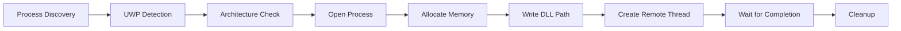

<div align="center">

[**English**](README.md) | [**中文**](README_CN.md)

# 🎯 Ruin DLL Injector

**A modern, lightweight DLL injector built with Rust and egui**

[](https://ko-fi.com/Y8Y01WG0DL)


</div>

---

## ✨ Overview

Ruin Injector is a powerful yet user-friendly DLL injector for Windows applications. Built with Rust's memory safety guarantees and egui's modern GUI framework, it provides a clean interface with advanced features like auto-injection, process filtering, and real-time logging.

**Inspired by [FateInjector](https://github.com/fligger/FateInjector)**

---

## 🚀 Quick Start

### Build from Source

```bash
git clone https://github.com/Ian-bug/ruin-injector.git
cd ruin-injector
cargo build --release
```

The compiled executable will be at `target/release/ruin-injector.exe`.

### Download Release

Get the latest pre-built binary from the [Releases](https://github.com/Ian-bug/ruin-injector/releases) page.

---

## 📋 System Requirements

- **OS**: Windows 10/11 (64-bit)
- **Privileges**: Administrator (recommended, but not always required)
- **Target**: DLL file to inject

---

## 🎮 Usage Guide

### Basic Injection

1. **Launch the Application**
   ```bash
   .\ruin-injector.exe
   ```
   *Right-click → "Run as administrator" for maximum compatibility*

2. **Select Your DLL**
   - Click the **Browse** button
   - Navigate to your DLL file
   - Select and confirm

3. **Choose Target Process**
   - Click the **List** button
   - Search or browse running processes
   - Click to select your target

4. **Inject**
   - Click **Inject DLL**
   - Monitor the log for status

### Auto-Injection Mode

Enable automatic injection when your target process starts:

- ☑️ Check the **Auto Inject** box
- Select your DLL file
- Choose your target process
- Ruin Injector will automatically inject when the process appears
- Settings persist between sessions

### Advanced Features

<details>
<summary>📊 Process Browser</summary>

- **Live Process List**: Real-time enumeration of all running processes
- **Search Filter**: Instant filtering by process name
- **Process Details**: Shows PID (Process ID) and name
- **UWP Detection**: Automatically flags Universal Windows Platform apps
- **Animated UI**: Smooth window transitions
</details>

<details>
<summary>🎨 Visual Enhancements</summary>

- **Type-Safe Animation System**: Custom Fade, Scale, Slide, and Pulse animations
- **Smooth Transitions**: Fade-in titles, sliding content, scaling dialogs
- **Log Animations**: New entries fade in smoothly
- **Status Indicators**: Animated pulses for admin/auto-inject status
- **Modal Blur**: Blurred background overlays for dialogs
</details>

<details>
<summary>⚡ Injection Options</summary>

- **Manual Inject**: Immediate injection on button click
- **Auto Inject**: Automatic detection and injection
- **Architecture Validation**: Ensures 32-bit/64-bit compatibility
- **UWP Protection**: Prevents injection into protected apps
</details>

<details>
<summary>🔧 Error Handling</summary>

- **Detailed Messages**: Contextual descriptions with actionable advice
- **Architecture Mismatch**: Clear explanation of bitness issues
- **UWP Warnings**: Informative alerts for unsupported apps
- **Permission Guidance**: "Try running as Administrator" hints
- **DLL Diagnostics**: Detailed failure causes (deps, anti-cheat, etc.)
</details>

---

## 🏗️ Architecture

### Project Structure

```
ruin-injector/
├── src/
│   ├── main.rs       # Entry point, egui UI, animation system
│   ├── injector.rs  # Core injection logic, Windows API
│   └── config.rs    # Configuration persistence
├── Cargo.toml        # Dependencies and metadata
├── build.rs          # Resource compilation (icon embedding)
├── icon.ico          # Application icon
├── cliff.toml        # Changelog configuration
├── AGENTS.md         # AI assistant guidelines
├── ICON.md           # Icon usage instructions
├── README.md         # This file
└── README_CN.md      # Chinese documentation
```

### Technology Stack

| Component | Technology |
|-----------|-----------|
| **Language** | Rust 2021 |
| **GUI Framework** | egui 0.27 |
| **Windows API** | windows-rs 0.54 |
| **File Dialog** | rfd 0.14 |
| **Serialization** | serde + serde_json |
| **Config Paths** | dirs 5.0 |
| **Timestamps** | chrono 0.4 |

---

## 🔬 Technical Implementation

### DLL Injection Workflow



#### Step-by-Step

1. **Process Discovery**
   - `CreateToolhelp32Snapshot(TH32CS_SNAPPROCESS)` enumeration
   - Iterate with `Process32First`/`Process32Next`

2. **UWP Detection**
   - Check for WindowsApps/AppPackages directories
   - `QueryFullProcessImageNameW` for accurate paths
   - Return `UwpProcessNotSupported` error

3. **Architecture Validation**
   - Injector bitness via `cfg(target_pointer_width)`
   - Target architecture via `IsWow64Process`
   - Prevent mismatched injections

4. **Process Access**
   - `OpenProcess(PROCESS_ALL_ACCESS, ...)`
   - Handle Windows permission model
   - Graceful failure on insufficient permissions

5. **Memory Allocation**
   - `VirtualAllocEx(...)` for target memory
   - `PAGE_READWRITE` protection

6. **DLL Path Injection**
   - `WriteProcessMemory(...)` for UTF-16 path
   - Validate path length (MAX_PATH_LENGTH = 260)

7. **Remote Thread Creation**
   - `CreateRemoteThread(...)` with `LoadLibraryW` entry point
   - 10-second timeout for completion

8. **Cleanup**
   - `WaitForSingleObject(...)` for thread completion
   - Check exit code (NULL = LoadLibraryW failed)
   - `VirtualFreeEx(...)` and `CloseHandle(...)` for resources

### Core Windows APIs

| API | Purpose |
|-----|---------|
| `CreateToolhelp32Snapshot` | Create process snapshot |
| `Process32First/Next` | Enumerate processes |
| `OpenProcess` | Access target process |
| `IsWow64Process` | Detect process architecture |
| `QueryFullProcessImageNameW` | Get full process path |
| `VirtualAllocEx` | Allocate memory in target |
| `WriteProcessMemory` | Write DLL path to target |
| `GetProcAddress` | Get function address |
| `CreateRemoteThread` | Create remote execution thread |
| `LoadLibraryW` | Load DLL in target process |
| `CloseHandle` | Release resources |
| `GetLastError` | Get error codes |
| `WaitForSingleObject` | Wait for thread completion |
| `GetExitCodeThread` | Check thread result |

### Animation System

A type-safe, modular animation architecture:

```rust
trait Animatable {
    fn update(&mut self, dt: f32);
    fn is_complete(&self) -> bool;
}

struct Fade { current: f32, target: f32, speed: f32 }
struct Scale { current: f32, target: f32, speed: f32 }
struct Slide { current: f32, target: f32, speed: f32 }
struct Pulse { phase: f32, speed: f32, amplitude: f32, base: f32 }
```

**Animation Types**:
- **Fade**: Alpha value interpolation for transparency
- **Scale**: Window size interpolation for dialogs
- **Slide**: Y-offset interpolation for panel movement
- **Pulse**: Continuous phase rotation for status indicators

**Key Constants**:
```rust
const ANIMATION_DEFAULT_SPEED: f32 = 0.12;
const ANIMATION_FAST_SPEED: f32 = 0.2;
const PULSE_SPEED_DEFAULT: f32 = 0.03;
const ALPHA_THRESHOLD: f32 = 0.01;
```

### Configuration Management

**Atomic Write Pattern**:
```rust
// Write to temp file first
let temp_path = config_path.with_extension("tmp");
fs::write(&temp_path, config_str)?;

// Then rename (atomic on most filesystems)
fs::rename(&temp_path, &config_path)?;
```

**Benefits**:
- Prevents corruption on crash/power loss
- Thread-safe configuration updates
- Graceful fallback on first run

### Error Handling

```rust
pub enum InjectionError {
    ProcessNotFound(String),
    OpenProcessFailed(String),
    MemoryAllocationFailed(String),
    WriteMemoryFailed(String),
    CreateRemoteThreadFailed(String),
    InvalidPath(String),
    InvalidProcessName(String),
    PathTooLong(String),
    DllLoadFailed(String),
    ThreadWaitFailed(String),
    UwpProcessNotSupported(String),
}
```

---

## 🛠️ Development

### Build Commands

```bash
# Release build (optimized)
cargo build --release

# Development build (faster)
cargo build

# Clean + rebuild
cargo clean && cargo build --release

# Fast compile check
cargo check
```

### Code Quality

```bash
# Run linter
cargo clippy

# Format code
cargo fmt

# Check formatting
cargo fmt --check

# Run tests
cargo test

# Tests with output
cargo test -- --nocapture
```

### Test Coverage (v1.3.1)

- 21 comprehensive unit and integration tests
- Process enumeration
- Input validation
- Error handling
- Configuration management
- UI logging functionality
- Animation system tests
- Modal animation tests
- Button hover animations

### Code Quality Standards

✅ Zero compiler warnings
✅ Zero clippy warnings
✅ Full rustfmt compliance
✅ All 21 tests passing
✅ Proper error handling and resource cleanup
✅ Named constants (no magic numbers)
✅ Type-safe animation system with traits
✅ Atomic config writes for data integrity
✅ RAII patterns for resource management

### For AI Assistants

See [AGENTS.md](AGENTS.md) for detailed guidelines on:
- Code style conventions
- Build/test commands
- Project structure
- Common pitfalls
- Testing strategies
- Animation system architecture

---

## 📈 What's New (v1.3.1)

### Recent Improvements

1. **Animation System Redesign**
   - Type-safe architecture with `Animatable` trait
   - Fade, Scale, Slide, Pulse animation types
   - Builder pattern for configuration
   - Zero magic numbers

2. **UWP Process Detection**
   - Checks WindowsApps/AppPackages directories
   - `UwpProcessNotSupported` error with warnings
   - Accurate path resolution

3. **Atomic Config Writes**
   - Temp file + rename pattern
   - Thread-safe updates
   - Graceful fallback handling

4. **Enhanced Error Messages**
   - Architecture mismatch detection
   - DLL load failure diagnostics
   - Actionable suggestions

5. **Production-Ready Codebase**
   - Zero warnings across all tools
   - Comprehensive test coverage
   - Clean, maintainable architecture

6. **Modal Animations**
   - Consistent scale + fade behavior
   - Window background fading
   - Unified animation patterns

---

## ⚠️ Important Notes

### Security Considerations

- **Antivirus Monitoring**: DLL injection is monitored by antivirus software
- **Permission Model**: Works with current privileges; admin may be needed
- **Protected Processes**: System processes cannot be injected
- **UWP Apps**: Restricted injection capabilities by design
- **Architecture**: Must match (32-bit ↔ 32-bit, 64-bit ↔ 64-bit)

### Best Practices

- 🔒 Test in safe environment first
- 💾 Backup original DLLs
- 📊 Monitor log output
- 🎯 Verify architecture matching
- 🚫 Avoid UWP applications
- 👤 Only inject processes you own

### Limitations

- System-protected processes (`csrss.exe`, `lsass.exe`) cannot be injected
- Real-time antivirus protection may block attempts
- Some processes require administrator access
- UWP apps are intentionally blocked
- Architecture mismatch prevents injection

---

## 📄 License

This project is provided **as-is** for **educational and development purposes only**.

### Usage Guidelines

- Only inject DLLs into processes you own or have permission to modify
- Do not use for malicious purposes
- Comply with applicable laws and regulations
- Authors are not responsible for misuse

---

## 🙏 Acknowledgments

- **Inspired by**: [FateInjector](https://github.com/fligger/FateInjector) - Original C++ implementation
- **Dependencies**:
  - [egui](https://github.com/emilk/egui) - GUI framework
  - [windows-rs](https://github.com/microsoft/windows-rs) - Windows API bindings
  - [rfd](https://github.com/PolyMeow/rfd) - File dialogs
  - [serde](https://github.com/serde-rs/serde) - Serialization
  - [dirs](https://github.com/dirs-dev/dirs-rs) - Config paths
  - [winres](https://github.com/mxre/winres) - Windows resources
  - [chrono](https://github.com/chronotope/chrono) - Timestamps
  - [git-cliff](https://github.com/orhun/git-cliff) - Changelog generation

---

## 🤝 Contributing

Contributions are welcome! Please feel free to:

- 🐛 Report bugs via issues
- 💡 Suggest new features
- 📝 Submit pull requests
- 📚 Improve documentation

When contributing, please follow guidelines in [AGENTS.md](AGENTS.md).

---

## 🔗 Links

- [GitHub Repository](https://github.com/Ian-bug/ruin-injector)
- [Issue Tracker](https://github.com/Ian-bug/ruin-injector/issues)
- [Release Notes](https://github.com/Ian-bug/ruin-injector/releases)
- [中文文档](README_CN.md)

---

<div align="center">

**Built with ❤️ using Rust** 🦀

</div>
